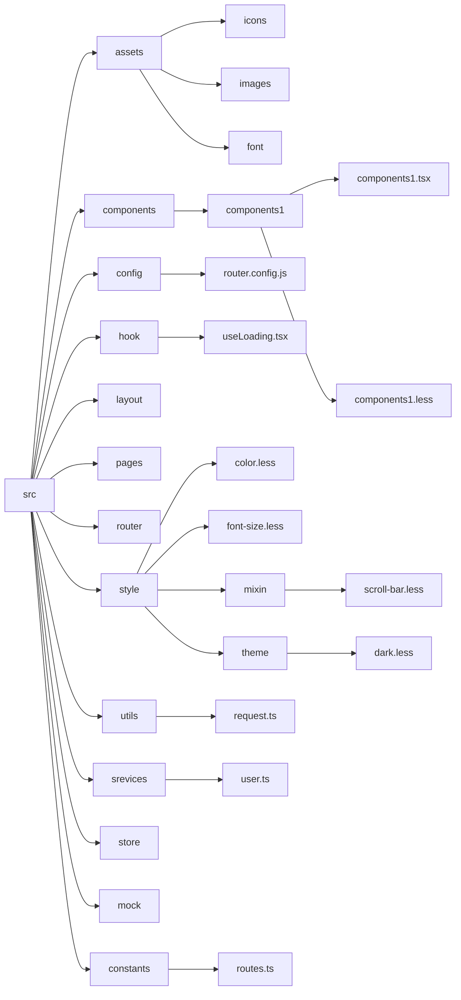

## 前端代码规范

#### 一、JS代码规范
###### 1.关于命名

普通命名采用小驼峰式命名
```js
let userName = 'jack'
```

命名是复数的时候需要加 s，比如说我想声明一个数组

```js
let names = new Array()
```

每个常量都需命名，这样更利于别人读懂含义

```js
// good
const COL_NUM = 10
let row = Math.ceil(num / COL_NUM)

// bad
let row = Math.ceil(num / 10)
```

命名需要符合语义化，如果函数命名，可以采用加上动词前缀：

- can 判断是否可执行某个动作
- has 判断是否含有某个值
- is 判断是否为某个值
- get 获取某个值
- set 设置某个值

```js
//是否可阅读
function canRead(){
   return true;
}
//获取姓名
function getName{
   return this.name
}
```

###### 2.关于字符串

统一使用双引号

用字符串模板而不是 '+' 来拼接字符串

###### 3.关于数组

用字面量赋值

```js
// bad
const items = new Array()

// good
const items = []
```

用扩展运算符做数组浅拷贝

```js
// bad
let arr = [1, 2, 3]
const len = arr.length
const copyArr = []

for (let i = 0; i < len; i += 1) {
  copyArr[i] = arr[i]
}

// good
const copyArr = [...arr]
```

用 Array.from 去将一个类数组对象转成一个数组。

```js
const arrLike = { 0: 'foo', 1: 'bar', 2: 'baz', length: 3 }

// bad
const arr = Array.prototype.slice.call(arrLike)

// good
const arr = Array.from(arrLike)
```

###### 4.关于对象

创建对象和数组推荐使用字面量

```js
// good
let obj = {
  name: 'Tom',
  age: 15,
  sex: '男',
}

// bad
let obj = {}
obj.name = 'Tom'
obj.age = 15
obj.sex = '男'
```

ES6 使用属性值缩写

```js
const lukeSkywalker = 'Luke Skywalker'

// bad
const obj = {
  lukeSkywalker: lukeSkywalker,
}

// good
const obj = {
  lukeSkywalker,
}
```

对象浅拷贝时，更推荐使用扩展运算符 ...，而不是 Object.assign。解构赋值获取对象指定的几个属性时，推荐用 rest 运算符(...)。

###### 5.关于函数

函数参数使用默认值替代使用条件语句进行赋值。

```js
// good
function createMicrobrewery(name = 'Jack') {
   ...
}

// bad
function createMicrobrewery(name) {
  const userNameName = name || 'Jack'
   ...
}
```

函数参数使用结构语法，函数参数越少越好，如果参数超过两个，要使用 ES6 的解构语法，不用考虑参数的顺序。

把默认参数赋值放在最后

```js
// bad
function handleThings(opts = {}, name) {
  // ...
}

// good
function handleThings(name, opts = {}) {
  // ...
}
```

尽量使用箭头函数

```js
// bad
[1, 2, 3].map(function (x) {
    const y = x + 1
    return x * y
  })

// good
 [1, 2, 3].map((x) => {
    const y = x + 1
    return x * y
  })
```

###### 6.关于模块

一个入口只 import 一次

```js
// bad
import foo from 'foo'
// … some other imports … //
import { named1, named2 } from 'foo'

// good
import foo, { named1, named2 } from 'foo'
```

在只有一个导出的模块里，用 export default 更好

```js
// bad
export function foo() {}

// good
export default function foo() {
```

###### 7.关于注释

推荐vscode插件：[koroFileHeader](https://link.juejin.cn/?target=https%3A%2F%2Fgithub.com%2FOBKoro1%2Fkoro1FileHeader)

- 文件注释

```js
/*
 * @Description: xxx
 * @Autor: wxy
 * @Date: 2021-07-06 14:40:30
 * @LastEditors: wxy
 * @LastEditTime: 2021-07-14 09:44:54
 */
```

- 代码块注释

  ```js
    /**
     * @description: 
     * @param {boolean} checked
     * @return {*}
     * @author: wxy
     */
  ```

- 行注释

  ```js
  // TODO ...
  // ! ...
  // FIXME ...
  // NOTE ...
  ```

- 下面是一些常用的注释标签

  ```js
  /**
   * @author  作者，方便定位    
   * @class（同义词：@constructor）标记类和构造函数    
   * @constant @const常量标记    
   * @description（同义词：@desc） 对内容进行描述    
   * @module 模块名称    
   * @enum 枚举类型标记    
   * @global 全局对象标记    
   * @param 函数参数标记    
   * @returns（同义词：@return）函数返回标记    
   * @this this指向标记    
   * @see 参考链接    
   * @memberof 标记模块间的从属关系    
   * @event 在模板中标记可以被触发的事件，与@fire配合使用
   * @alias 将成员视为具有不同的名称。
   * @Async 表示函数是异步的。
   * @augments（同义词：@extends）指示符号从父符号继承并添加到父符号。
   * @borrows 此对象使用来自另一个对象的内容。
   * @callback 回调函数。
   * @copyright 版权信息。
   * @default （同义词: @defaultvalue） 默认值。
   * @example 示例。
   */
  ```

###### 8.[eslint](https://eslint.org)规范

.eslintrc.js文件配置的代码：

```js
"off" or 0 ：关闭规则;
"warn" or 1 ：将规则视为一个警告（不会影响退出码）;
"error" or 2 ：将规则视为一个错误 (退出码为1);

module.exports = {
    // 开启推荐配置信息
    // "extends": "eslint:recommended",
    // 默认情况下，ESLint 会在所有父级目录里寻找配置文件，一直到根目录。如果你想要你所有项目都遵循一个特定的约定时，这将会很有用，但有时候会导致意想不到的结果。为了将 ESLint 限制到一个特定的项目，在你项目根目录下的 package.json 文件或者 .eslintrc.* 文件里的 eslintConfig 字段下设置 "root": true。ESLint 一旦发现配置文件中有 "root": true，它就会停止在父级目录中寻找。
    "root": true,
    // 脚本在执行期间访问的额外的全局变量
    // 当访问未定义的变量时，no-undef 规则将发出警告。如果你想在一个文件里使用全局变量，推荐你定义这些全局变量，这样 ESLint 就不会发出警告了。你可以使用注释或在配置文件中定义全局变量。
    "globals" : {
        "window":true,
        "document":true,
        "$":true
    },
    // 设置插件
    // "plugins": [
    //     'html'
    // ],
    // 设置解析器选项（必须设置这个属性）
    "parserOptions": {
        "ecmaVersion": 7,
        "sourceType": "module",
        "ecmaFeatures": {
            "jsx": true,
            // "arrowFunctions": true,
            // "experimentalObjectRestSpread": true,
            // "classes": true,
            // "modules": true,
            // "defaultParams": true
        }
    },
    // 启用的规则及各自的错误级别
    "rules" : {
      'indent': [1, 2], // 缩进使用两个空格的宽度
        'no-console':1,// 禁止用console
        'semi': [1, 'always', { omitLastInOneLineBlock: true }], // 使用分号结束语句，除了语句块独占一行
        'no-redeclare':1,// 在同一个作用域中禁止多次重复定义
        'no-unneeded-ternary': 1, // 禁止使用没有必要的三目运算符，?: 通常出现在返回结果是一个布尔值，和单个变量之间的比较（直接赋值或者使用||运算符）
        'no-unused-vars': 2, // 禁止申明一个变量，但不使用
        'no-use-before-define': 2, // 禁止在变量，函数，类申明前使用
        'keyword-spacing': 1, // 关键词前后要加空格
        'comma-spacing': 1, // 逗号运算符两边空格：前面不加，后面加
        'no-dupe-keys':2, //对象字面量不定义重复的属性
        'no-duplicate-case':2, // switch语句中不定义重复的case分支
        'no-eq-null':2, // 不使用 == 或 != 操作符与null进行比较
        'no-inner-declarations':2, // 嵌套代码块中禁止定义函数或使用var声明变量
        'no-var':2, // 使用let或者const 代替 var
        'no-this-before-super':2, // 使用 this 前请确保 super() 已调用
        'no-undef':2, // 对于未声明的变量引用会导致警告
        'no-unreachable':2, // return，throw，continue 和 break 后不要再跟代码
        'eqeqeq':2, // 使用 === 代替 ==
        'quotes': ['2', 'double'], // 除需要转义的情况外，字符串统一使用双引号
        'use-isnan': 2, // 判断类型是不是NAN使用isNaN()
    },
    // 指定你想启用的环境
    "env": {
        "browser": true,
        "node": true
    },   //babel  eslint都是babel公司出的
    "parser": "babel-eslint"//配置解析es6
};
```

#### 二、css

###### 1.[BEM规范](http://www.divcss5.com/css3-style/c56988.shtml)

- block：模块，名字单词间用 - 连接

- element：元素，模块的子元素，以 __ 与 block 连接

- modifier：修饰，模块的变体，定义特殊模块，以 -- 与 block 连接

  ```css
  /* 举个例子 */
  .block__element {
  }
  .block--modifier {
  }
  ```

  

###### 2.初始化规范

各浏览器厂商的初始样式都不一样，为了消除不同浏览器对 HTML 文本呈现的差异，我们常引入一些初始化样式，如 normalize.css、reset.css 等，当对于这些样式的引入我们需要注意下面几种情况：

- 不使用 UI 框架，由零开始搭建
   从零开始搭建的情况下，进行样式初始化，在项目最开始的时候就引入，不要在开发中途引入，避免不可预知的样式冲突。
- 不使用 UI 框架，但使用了部分插件
   插件往往都带有自己特有的样式，如富文本插件，在开发中途使用初始化样式有可能导致样式错乱，所以不建议大范围的初始化，只需`简单进行初始化`即可。

```
* {
  padding: 0;
  margin: 0;
}
复制代码
```

- 已使用 UI 框架
   在明确知道需要使用 UI 框架的时候，`不使用第三方初始化样式`，不管是在项目开始前还是进行中，因为 UI 框架一般都自带初始化，额外引入了反而会影响原有效果。

###### 3.避免重绘重排

当发生重排的时候，浏览器需要重新计算布局位置与大小，不利于性能优化。

常见引起重绘重排属性和方法

- 添加或者删除可见的 `DOM` 元素；

- 元素尺寸改变——边距、填充、边框、宽度和高度

- 内容变化，比如用户在 `input` 框中输入文字

- 浏览器窗口尺寸改变——`resize` 事件发生时

- 计算 `offsetWidth` 和 `offsetHeight` 属性

- 设置 `style` 属性的值

减少重绘重排的方法

- 使用 `transform` 替代 `top`

- 使用 `visibility` 替换 `display: none` ，因为前者只会引起重绘，后者会引发回流（改变了布局）

- 不要把节点的属性值放在一个循环里当成循环里的变量。

- 不要使用 `table` 布局，可能很小的一个小改动会造成整个 `table` 的重新布局

- 动画实现的速度的选择，动画速度越快，回流次数越多，也可以选择使用 `requestAnimationFrame`

- CSS 选择符从右往左匹配查找，避免节点层级过多

###### 4.颜色

建议不使用命名色值。推荐vscode插件**Color Highlight**

```css
/* good */
.button--success {
  color: #90ee90;
}

/* bad */
.button--success {
  color: lightgreen;
  }
```

###### 5.字体排版

1. 字号

   因为 Windows 的字体渲染机制，小于 12px 的文字显示效果极差、难以辨认。所以在 Windows 平台显示的中文内容，其字号应不小于 12px。

2.字重

font-weight 属性建议使用数值方式描述。

```css
 /* good */
h1 {
   font-weight: 700;
}

/* bad */
h1 {
   font-weight: bold;
}
```

3.行高

line-height 在定义文本段落时，应使用数值。将line-height 设置为数值，浏览器会基于当前元素设置的 font-size 进行再次计算。在不同字号的文本段落组合中，能达到较为舒适的行间间隔效果，避免在每个设置了 font-size 都需要设置line-height。如果line-height 用于控制垂直居中，应该设置成与容器高度一致。

```css
 /* good */
 .container {
   line-height: 1.5;
 }
 

/* bad */
.container {
   line-height: 15px;
 }
```


#### 三、图片

###### 1.使用恰当的图片格式。

- jpg：适用于内容图片多为照片之类的。
- png：适用于而饰图片，通常更适合用无损压缩。
- gif： 基本上除了 gif 动画外不要使用。
- webP：大大减小图片的体积，但是移动端有兼容性问题。


###### 2.使用雪碧图

雪碧图，`CSS Sprites`，国内也叫 CSS 精灵，是一种 CSS 图像合成技术，主要用于小图片显示。

雪碧图的优点是把诸多小图片合成一张大图，利用`backround-position`属性值来确定图片呈现的位置，这样就能减少 http 请求，到达性能优化的效果。

###### 3.使用 iconfont

`iconfont`(字体图标)，即通过字体的方式展示图标，多用于渲染图标、简单图形、特殊字体等。

使用 `iconfont` 时，由于只需要引入对应的字体文件即可，这种方法可有效减少 HTTP 请求次数，而且一般字体体积较小，所以请求传输数据量较少。与直接引入图片不同，`iconfont` 可以像使用字体一样，设置大小、颜色及其他样式，且不存在失真的情况。

###### 4.图片懒加载

图片过多时，可以使用图片懒加载，原理就是暂时不设置图片的 `src` 属性，而是将图片的 `url` 隐藏起来，比如先写在 `data-src` 里面，等某些事件触发的时候(比如滚动到底部，点击加载图片)再将图片真实的 `url` 放进 `src` 属性里面，从而实现图片的延迟加载。

#### 四、React

###### 1.项目目录结构



###### 2.基础规则

- **一个文件声明一个组件：**尽管可以在一个文件中声明多个 React 组件，但是最好不要这样做；推荐一个文件声明一个 React 组件，并只导出一个组件；
- **推荐使用函数组件**

###### 3.组件声明

组件名称和定义该组件的文件名称建议要保持一致；

```react
// good
import Footer from './Footer';

//bad
import Footer from './Footer/index';
```

在src目录下的componets文件推荐使用推荐使用大驼峰命名，在pages中生命的文件采用小写和`-`符号连接

###### 4.JSX写法注意

1. 当标签没有子元素的时候，始终使用自闭合的标签 

   ```react
   // good
   <Component />
   
   // bad
   <Component></Component>
   
   ```

2. 如果标签有多行属性，关闭标签要另起一行 。

   ```react
   // good
   <Component
     bar="bar"
     baz="baz" 
   />
   
   //bad
   <Component
     bar="bar"
     baz="baz" />
   ```

   

3.在自闭标签之前留一个空格

```react
// good
<Foo />

//bad
<Foo/>

<Foo                 />

<Foo
 />
```

4.当组件跨行时，要用括号包裹 JSX 标签。

```react
// good
  render() {
    return (
      <MyComponent className="long body" foo="bar">
        <MyChild />
      </MyComponent>
    );
  }

// bad
  render() {
    return <MyComponent className="long body" foo="bar">
             <MyChild />
           </MyComponent>;
  }
```

###### 5.样式写法

React 中样式可以使用 style 行内样式，也可以使用 className 属性来引用外部 CSS 样式表中定义的 CSS 类，推荐使用 className 来定义样式。使用less 来替换传统的 CSS 写法,需要动态修改样式时，推荐使用classnames插件

