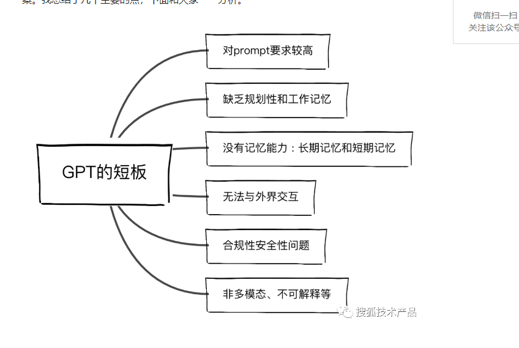

#### 8/1
1. 今天做的是公司的发版工作，已经上午讨论像素流启动的问题

#### 8/2
1. 信令服务器:是一种用于传递元数据的服务器，用于在设备之间建立通信。它是WebRTC中最重要的服务器之一
 a. 用于验证身份信息
 b. NAT穿透：信令服务器可以用于帮助设备在NAT后直接通信。例如，它可以帮助设备发现其公共IP地址和端口号，并将其传递给其他设备，以便它们可以直接建立连接。
 c. 会话管理：信令服务器可以用于管理WebRTC会话。例如，它可以跟踪哪些用户已连接到会话，哪些用户已离开会话，以及哪些用户可以与其他用户进行直接通信
 d: 路由和负载均衡：在大规模WebRTC应用程序中，信令服务器可以用于路由媒体流，并确保它们被正确地传递到目标设备。它还可以用于负载均衡，以确保媒体流在多个服务器之间均衡分配

#### 8/3
1. [前端错误监控](https://github.com/xy-sea/blog/blob/main/markdown/%E4%BB%8E0%E5%88%B01%E6%90%AD%E5%BB%BA%E5%89%8D%E7%AB%AF%E7%9B%91%E6%8E%A7%E5%B9%B3%E5%8F%B0%EF%BC%8C%E9%9D%A2%E8%AF%95%E5%BF%85%E5%A4%87%E7%9A%84%E4%BA%AE%E7%82%B9%E9%A1%B9%E7%9B%AE.md)
2. package.json中的unpkg字段

#### 8/4
1. [curl使用指南](https://mp.weixin.qq.com/s/tNgx65hSBGeIjvbW_5ydRQ)
2. [linux常用命令](https://www.wangan.com/wenda/4462)

#### 8/7
1. [兼容性插件eslint-plugin-builtin-compat](https://mp.weixin.qq.com/s/k7WJIxt6zWN4vt8F3c9ntA)
2. 前端错误监控`newrelic`
3. PWA（Progressive Web App）旨在解决传统网页应用和原生应用之间存在的一些问题
包括：
    用户体验：PWA 提供更接近原生应用的用户体验。它们可以在离线状态下运行，具有快速加载和流畅的导航，以及与设备硬件（如推送通知、摄像头、地理位置等）的集成。PWA 还能够自适应不同设备和屏幕尺寸，提供响应式布局和交互。

    可靠性：PWA 使用 Service Worker 技术，可以缓存关键资源并在离线状态下继续工作。这意味着用户可以在网络连接不稳定或断开的情况下继续使用应用程序，而无需等待页面加载或失去功能。

    安装和访问：PWA 可以像原生应用一样通过应用商店进行安装，也可以通过 URL 直接访问。用户可以将 PWA 添加到主屏幕或启动器，方便快速访问，无需下载和安装。

    更新和部署：PWA 的更新和部署更加简便。由于它们基于网络，开发人员可以通过服务器端的更新来实时提供新的功能和修复错误，无需用户手动更新应用程序。

    跨平台和设备：PWA 可以在各种平台和设备上运行，包括桌面、移动设备和平板电脑。它们具有一致的用户界面和功能，无论用户使用的是哪种设备或操作系统。

    成本和开发效率：PWA 的开发成本相对较低，并且可以跨多个平台和设备使用相同的代码库。这降低了开发和维护多个原生应用的复杂性和成本。

总的来说，PWA 通过将网页技术与原生应用功能结合，提供了更好的用户体验、可靠性和可访问性，同时降低了开发和部署的复杂性。它们为开发人员和用户提供了一种灵活、高效和现代化的应用程序开发和交付方式。
2. webscoket，在websocket中请求头和普通http的协议有点不同，比如connection:upgarde,upgrade:websocket,webscoket是右自己的协议的，也有自己传输数据的格式，是二进制的数据，并且每次都可能不一样，他会自动的进行分片

#### 8/9
1. [ts阮一峰教程](https://wangdoc.com/typescript/tsconfig.json)

#### 8/10
1. [安装codeium](https://mp.weixin.qq.com/s/3EtQUnq1peEiqUi-zLkObg)
2. [react-router hishory api](https://mp.weixin.qq.com/s/gbQdApXSxDvesSnphmyifQ)

#### 8/11
1. [changelog 类型]https://blog.csdn.net/wyhbest/article/details/122789174

#### 8/14
1. [interface和type区别](https://mp.weixin.qq.com/s?__biz=MzkyOTE5NzQ2Nw==&mid=2247485013&idx=1&sn=9324e663eb2d6ed02a2f167e12b56692&chksm=c20c7aa1f57bf3b7f7e00ecc07d753a201ea08da5ad083dc5f70adc8553ef731f9e295afe8a2&scene=21#wechat_redirect)
2. [光栅化](https://mp.weixin.qq.com/s/Yj1r8SRUrOoqvVRokp7i1Q)

#### 8/15
1. monorepo进行调试，众所周知，在使用monorepo调试时，只需要安装对应的包即可，比如你使用的是pnpm包管理器，包bb想调用包aa的方法或者属性只需要
`pnpm add aa -F bb`即可，但是如果aa打包之后，package.json中的mian文件执行就发生了变化，如何本地调试呢，使用export字段

#### 8/16
1. [class-transformer](https://www.5axxw.com/wiki/content/pgml88)
2. [AOT和JIT](https://mp.weixin.qq.com/s/ALaPDGtaQ-7hU1e9T0vXng)
    "AOT" 和 "JIT" 是计算机编程领域中的两个术语，分别代表了不同的编译和执行方式。

    - AOT（Ahead-of-Time Compilation）：AOT 编译是一种编译方式，其中代码在程序运行之前被编译成机器代码。这意味着在程序执行时不再需要进行实时的代码编译，从而提高了程序的启动速度和执行效率。AOT 编译通常用于需要高性能、低延迟的应用，比如操作系统内核、嵌入式系统、游戏引擎等。Java 中的 AOT 编译技术就有 GraalVM 的 Native Image，它可以将 Java 程序编译成本地机器码，从而避免了传统的 Java 虚拟机（JVM）执行过程。

    - JIT（Just-In-Time Compilation）：JIT 编译是一种在程序运行时动态编译代码的方式。在 JIT 编译中，程序代码首先被解释执行，然后在运行时，部分代码会被编译成机器代码以提高执行效率。这种方式的优势在于可以针对特定的执行环境和数据流进行优化，但会在程序启动时引入一些额外的延迟，因为编译过程需要一些时间。Java 的 HotSpot JVM 就使用了 JIT 编译技术，根据代码的执行情况来决定哪些代码段需要被编译成机器码。

    总结：
    - AOT 编译是在程序运行之前将代码编译成机器码，以提高启动速度和执行效率，适用于需要高性能的应用。
    - JIT 编译是在程序运行时动态编译代码，根据实际执行情况进行优化，适用于需要平衡性能和启动速度的应用。
3. 学习chatgpt
4. 帮助排查xt-earth使用问题

#### 8/17
1. 由于需要figma中的json转BI平台对应的json，本来想使用openai来生成，但是token有限以及，每天不能超过两百次，除非充钱，于是我想先手动进行转化，于是参考了各种设计模式，比如
策略模式（与状态模式的区别就是他的行为不会根据策略变而变化）
状态模式
适配器模式
工厂模式

#### 8/18
1. [webpack打包](https://mp.weixin.qq.com/s/ALPNWOqiPAPcJJ73SsZwqg)

#### 8/21
1. 低代码平台远程加载图表，图表颜色会出现联动，或者跟上一个一样，后来排查是ecahrts的渲染模式问题，修改成`canvas`就可以了，`echarts`底层基于`zrender`实现
2. [source map调试](https://mp.weixin.qq.com/s/ttrPW--3Hs3fjpAnVd793w)
3. [图片加载方式，包括一下图片、svg过渡插件](https://mp.weixin.qq.com/s/8z7Z1KuLzIPPptTpkloPZw)
4. [浏览器缓存，强缓存、协商缓存](https://mp.weixin.qq.com/s/GDCLNmlG84dAu3D_mQSD7w)
5. UML的类图实践https://boardmix.cn/app/editor/xRrX65cqMnDCuMiU_mxCDQ?inviteCode=VJ2kHe，
其中是各种类之间的关系
[依赖、关联、聚合、组合、泛化](https://blog.csdn.net/java_kider/article/details/109241122)

#### 8/24
1. [更好的构建AI应用](https://mp.weixin.qq.com/s/4702kgYGUv5eNV6KrvsTbw)
openai的优缺点

2. [ts v5.2](https://mp.weixin.qq.com/s/ZqsNNq0tmMt76kUFi7P_Kg)
- 装饰器元数据
- 元组数组方法
- 显示资源管理 dispose using
- 命名和匿名元组元素
- 逗号补齐功能
- 内联变量重构

#### 8/26
1. [双token的无感刷新](https://mp.weixin.qq.com/s/O9Ilw34IB0k2_cns6ErkWw)

#### 8/28
1. [webgpu初识](https://zhuanlan.zhihu.com/p/650375016)
2. [移除事件监听的几种方法](https://mp.weixin.qq.com/s/JIhaQ9-EsNt66baYg4oXRQ)

#### 8/29
1. [Scheduler.yield](https://mp.weixin.qq.com/s/HjyBH8ZRwuNgwufMDc4bgQ)
2. [WebGPU 上下文创建过程中所需 GPU 功能的选项](https://hpdvcnjj93.feishu.cn/mindnotes/LEBJbNZ1gmy2OznySGwcerQdn0f#mindmap)`babylone` `requiredFeatures`选项意思
3. [WebGPU性能测试分析](https://zhuanlan.zhihu.com/p/387054998)
- 影响FPS的因素 CPU传递Draw Call + GPU时间
- Draw Call
    a. 在传统的图形渲染管线中，CPU传递Draw Call是通过调用图形API（如OpenGL或DirectX）中的渲染函数来实现的。以下是一般的流程：
    
    b. 设置渲染状态：CPU会设置渲染状态，如混合模式、剔除模式、深度测试等。这些状态会影响绘制的结果。

    c. 绑定顶点数据：CPU会将顶点数据绑定到GPU的顶点缓冲区中。顶点数据包括顶点位置、法线、颜色、纹理坐标等。

    d. 绑定着色器程序：CPU会将着色器程序绑定到GPU的着色器阶段中。着色器程序定义了如何处理顶点和像素的逻辑，包括顶点着色器和片元着色器。

    e. 绑定纹理和其他资源：CPU会将纹理、缓冲区和其他需要的资源绑定到GPU的纹理单元和着色器阶段中，以供着色器程序使用。

    f. 发送Draw Call：CPU会调用渲染函数，将绘制命令发送给GPU，告诉它绘制场景中的图元。Draw Call包含了绘制的类型（如三角形、线条等）、顶点数量、顶点偏移等信息。

    g. 一旦GPU接收到Draw Call，它会按照CPU指定的参数和数据进行绘制操作。GPU会并行处理多个Draw Call，以提高绘制效率和性能。

    h. 需要注意的是，随着新的图形API的出现，如WebGL和WebGPU，CPU传递Draw Call的方式可能有所不同。例如，在WebGL中，可以使用WebGL上下文的绘制函数来发送Draw Call。而在WebGPU中，可以使用WebGPU命令编码器来记录和传递绘制命令。

