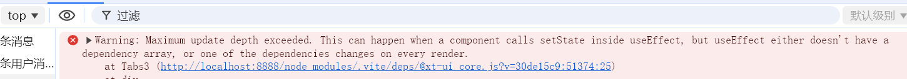
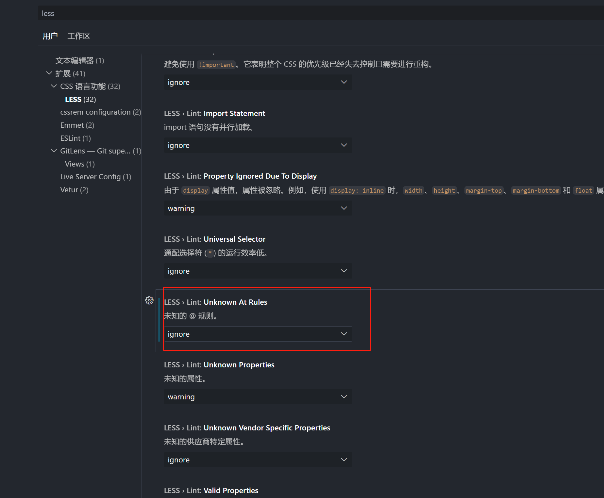

#### 10/8
1. [query请求](https://mp.weixin.qq.com/s/NtxIAJbbomqMGmYNZmrmgA)
2. HDR、ENV 和 DDS 是三种不同类型的纹理格式，它们在用途和特点上有所区别：

##### - HDR (High Dynamic Range)
- **格式**：常见扩展名为 `.hdr`，也可能是 `.exr`（OpenEXR）。
- **特点**：支持更高的动态范围，能够表示更亮的光源和更多的细节，适用于需要准确光照和高光效果的场景。
- **用途**：主要用于环境光照和背景，尤其在需要真实感渲染的场景中，如室外场景的天空或高亮区域。

##### - ENV (Environment Map)
- **格式**：一般是 `.env`，但具体格式取决于创建工具。
- **特点**：用于环境映射，通常包含了一个或多个方向的图像（如立方体贴图或球形贴图），帮助模拟反射和折射效果。
- **用途**：常用于实时反射效果，特别是在物体表面（如水面或金属表面）上反射周围环境。

##### - DDS (DirectDraw Surface)
- **格式**：扩展名为 `.dds`。
- **特点**：支持多种压缩格式（如 DXT1、DXT5），在存储时能够有效减少文件大小，同时保持较高的纹理质量。
- **用途**：常用于实时渲染游戏和应用，特别适合大规模的纹理使用，如角色、物体表面等。因其支持 mipmaps 和各种压缩格式，性能表现良好。

##### 总结
- **HDR**：主要用于高动态范围图像，适合真实感渲染。
- **ENV**：用于环境映射，模拟反射效果。
- **DDS**：适合高效存储和快速渲染，支持多种压缩格式，适用于大规模纹理。 

选择合适的纹理格式取决于具体的需求和场景类型。

#### 10/9
1. [http网络优化](https://mp.weixin.qq.com/s/2C7w4iL4DLa1QXqq-37SAw)

#### 10/10
1. [三维视频融合](https://mp.weixin.qq.com/s?__biz=Mzg4ODEyNzMwNA==&mid=2247493671&idx=1&sn=27c93c9a764dcba5e74cac6bd3bb29ee&chksm=cffd4200f88acb16af2c9df9c01537cccf6358409fba72b6635d9b3d3251b830b10b58980266#rd)
2. NDC（Normalized Device Coordinates，标准化设备坐标）和场景坐标系是图形学中的两个不同的坐标系，主要用于不同阶段的图形渲染过程。它们之间的区别和联系可以通过转换流程来理解。

### 区别：
1. **定义不同**：
   - **场景坐标系**（也称为世界坐标系）：用于描述3D场景中物体在场景中的绝对位置。坐标值可能是任意的，取决于场景的单位设定。
   - **NDC**（标准化设备坐标系）：用于描述物体在投影后相对于设备的标准化位置。坐标范围通常是 `[-1, 1]`（x 和 y 轴）和 `[0, 1]` 或 `[-1, 1]`（z 轴）。这是在投影矩阵处理之后的坐标系，适用于最终将3D坐标映射到2D屏幕。

2. **坐标范围不同**：
   - **场景坐标系**：坐标值是无限的，物体可以在整个场景中任意摆放，坐标没有标准化限制，单位取决于场景需求。
   - **NDC**：所有物体的坐标都被压缩到 `[-1, 1]` 的标准范围内，用于描述物体在屏幕上显示的位置和大小。

3. **用途不同**：
   - **场景坐标系**：用于物体在3D空间中进行定义和操作，例如物体的位置、旋转、缩放等变换。
   - **NDC**：用于屏幕空间的表示，是物体经过投影矩阵变换后的结果，准备将物体渲染到屏幕。

### 联系：
1. **转换关系**：
   - **从场景坐标系到NDC的转换**：物体的坐标会通过几个矩阵变换逐步转换到NDC。这包括：
     1. **模型变换**：将物体从局部坐标系转换到场景坐标系。
     2. **视图变换**：将场景坐标系转换到相机坐标系，使相机成为观察的参考点。
     3. **投影变换**：将相机坐标系转换到NDC。透视投影会将视野范围内的物体压缩到 `[-1, 1]` 的标准范围内。
  
2. **共同点**：
   - 它们都是3D渲染管线中的一部分：场景坐标系定义了物体在世界中的位置，而NDC则是场景经过相机观察和投影后的结果，确保物体能够正确地渲染到屏幕上。

### 渲染流程中的转换：
1. **场景坐标系**：物体的初始位置在场景中。
2. **视图坐标系**：通过相机的视图矩阵将物体转换到相机的坐标系。
3. **投影坐标系**：通过投影矩阵（如透视投影矩阵）将物体转换到NDC。
4. **NDC**：将物体的坐标映射到标准的 `[-1, 1]` 空间，便于光栅化和最终在屏幕上显示。

简单来说，**场景坐标系描述的是物体在3D世界中的位置，而NDC是物体在投影后准备被绘制到屏幕上的位置**。
3. [菲涅尔效应](https://www.voidsky.cn/2020/02/20/%E8%AE%A1%E7%AE%97%E6%9C%BA%E5%9B%BE%E5%BD%A2%E5%AD%A6%EF%BC%9A%E8%8F%B2%E6%B6%85%E5%B0%94%E6%95%88%E5%BA%94-Fresnel-Effect/)
4. 今天遇到一个奇怪的bug，以下错误应该很明显，就是useEffect里面的操作在不停地执行

代码如下,因为useEffect没有监听任何值，onViewMatrixChangedObservable方法会一直执行，但是其中也没有setState的操作，居然还会报这个错误，解决方式是加一个防抖操作
```tsx
  useEffect(() => {
    const activeCamera = engine.getScene().activeCamera;

    // activeCamera?.onViewMatrixChangedObservable.add(() => {
    //   const { alpha, beta, radius, target } = activeCamera as SceneCamera;
    //   updateSceneLayerData({ alpha, beta, radius, target }, false, false);
    // });

     activeCamera?.onViewMatrixChangedObservable.add(debounce(() => {
      const { alpha, beta, radius, target } = activeCamera as SceneCamera;
      updateSceneLayerData({ alpha, beta, radius, target }, false, false);
    }, 10));
    return () => {
      activeCamera?.onViewMatrixChangedObservable.clear();
    };
  }, []);
```
5. [useSyncExternalStore](https://mp.weixin.qq.com/s/3WvDXZkNsCsvzdbuRI_LRg)


#### 10/11
1. 使用`unocss`在`less`文件中编写类名会使用`@apply`关键字，解决方案是在`vscode`的`settings`中设置`ignore`


#### 10/14
1. [ollama拉取huggingface](https://mp.weixin.qq.com/s/lG_opA0I9YHFnaA7sIil5A)
