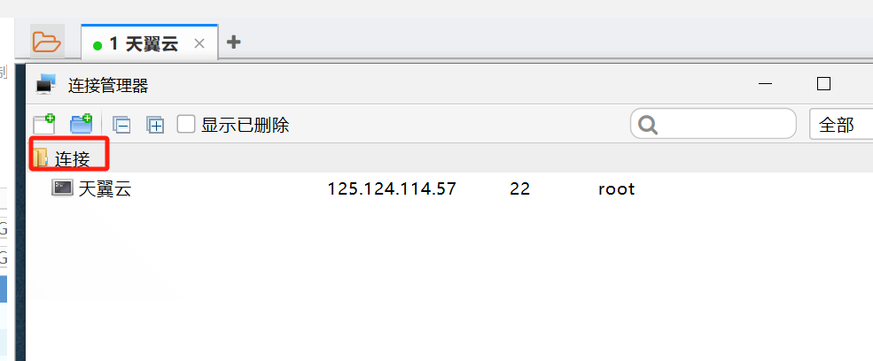

#### 4/1
1. 全景编辑器终于完成了
但是遇到ios中播放视频打不开，原因是ios客户端使用video标签解析视频时会根据响应的请求头进行读取数据，响应头需要包含文件大小，如果没有就无法解析视频，但是在安卓客户端和浏览器上是没有这种问题的，所以需要兼容ios。最后由后端添加配置
2. 使用swiper动态加载轮播图，在ios环境下，滑动数据项会造成页面的刷新，后来排查是因为数据量太多导致的，使用Virtual模式，来避免这个问题


#### 4/3
1. [react19](https://mp.weixin.qq.com/s?__biz=MzU2MTIyNDUwMA==&mid=2247527975&idx=1&sn=f23965972081924a442221fb803e13cf&chksm=fc7e207ccb09a96a09cbc164bf17ad50b94777e3f7e2c60439ead2124c201264b78cc725905d#rd) 
 - 新hooks:`use`等
 - 服务端渲染
 - 资源加载的优化
 - form的actions
 - 元数据的支持可以直接在组件内部写title meta
 - react更新优化，内部处理memo、useCallback的逻辑
 
 #### 4/7
 1. (npm依赖)[https://mp.weixin.qq.com/s/qJS7lu_YWHL09QiBSQ2WDA]
 2. (文件检测工具Magika)[https://mp.weixin.qq.com/s/Gu5rR3h4FhxhJjp9NADewA]


 #### 4/8
1. react18批处理自动更新
2. useeventeffect
3. 函数组件比类组件的优势在于它更符合ui =fn(state)的设计，方便集中管理
4. useeffect看出react和vue设计理念的区别

 #### 4/9
 1. bat文件启动node服务
 ```js
const http = require('http');
const fs = require('fs');
const path = require('path');
const config = require('./config.js');

const server = http.createServer((req, res) => {
    fs.readFile(path.resolve(__dirname, config.root), (err, data) => {
        if (err) {
            res.writeHead(500);
            res.end('Server Error');
        } else {
            res.writeHead(200, { 'Content-Type': 'text/html' });
            res.end();
        }
    });
})


server.on('error', (err) => {
    if (err.code === 'EADDRINUSE') {
        console.error(`端口 ${config.port} 已被占用，请选择其他端口。`);
    } else {
        console.error('服务器错误:', err);
    }
});


server.listen(config.port, (data) => {
    console.log(`服务运行 http://127.0.0.1:${config.port}/`);
});
```

```bash
node server.js
```

#### 4/11
1. tc39 signal新提案，统一数据的反应性
dai-shi大佬写的`use-signal`库，非常巧妙，代码也很少，基于useSyncExternalStore
https://github.com/dai-shi/use-signals


#### 4/12
1. [fetchLater](https://mp.weixin.qq.com/s?__biz=MjM5MTA1MjAxMQ==&mid=2651270139&idx=1&sn=2c094d7b2191b5cdb7e0ffb37215bdc8&chksm=bd48f27f8a3f7b69bd5b610990aa344e9de98088a0ed72ae833cd9ab93028245e904229757d5#rd)


#### 4/13
1. gitlab ci中pnpm install报错问题，根据排查指向了pnpm-store的问题，当前目录下有一个.pnpm-store文件，于是我将store更改了位置
`pnpm set store-dir '~/.pnpm-store'`这样不会在当前文件的根目录生成一个.pnpm-store文件夹，最后解决了问题,参考https://segmentfault.com/a/1190000043733825
2. [jotai、zhustand的区别](https://mp.weixin.qq.com/s?__biz=Mzg3OTYzMDkzMg==&mid=2247501248&idx=1&sn=a64199b7eab19db56a9c44511a9ad7f3&chksm=ce422314cdc8655d3ba9dfa041e02c7d9b7bf6068dab17b28b7733deeffd10a755de2f4d9d28&scene=126&sessionid=1712990255#rd)
3. 读取远程静态资源进行下载，例如读取图片,使用blob是一种方式，也可以使用FileReader进行读取
```tsx
axios({
                method: "get",
                url: url,
                responseType: "blob"
            }).then((res) => {
                const file = new Blob([res.data], {type: "image/jpg"})
                  resolve({
                        name: url,
                        ext: "jpg",
                        content:file
                    })
            }).catch((err) => {
                reject(err)
            })
```
4.  ArrayBuffer和Stream的区别：

  **ArrayBuffer**：
   - 用途：用于存储二进制数据，如图像数据等。
   - 特点：是RAM中的二进制数据块，可以通过Typed arrays（如Uint16Array）、Uint8Array和DataView等方式读取和写入数据。
   - 示例用途：处理复杂数据结构，如与WebGL、数据文件或C结构交互等。

 **Stream**：
   - 用途：处理流式数据，如大型文件、视频等。
   - 类型：可读流（Readable）、可写流（Writable）、双工流（Duplex）和转换流（Transform）。
   - 示例用途：复制文件、处理HTTP请求等。

ArrayBuffer和Stream的应用场景：

 **ArrayBuffer**的应用场景：
   - 处理图像数据：可以存储图像的二进制数据。
   - 处理网络数据包：用于构建和解析网络数据包，如UDP协议。
   - 与复杂数据结构交互：通过多个视图从不同偏移量读取数据，与复杂数据结构交互。

 **Stream**的应用场景：
   - 文件操作：复制文件、读取大型文件等。
   - 网络通信：处理HTTP请求、处理视频流等。
   - 数据处理：处理大量数据，避免一次性加载到内存中。

综上所述，ArrayBuffer适用于存储和处理二进制数据，而Stream适用于处理流式数据，如文件、网络数据等。具体应用场景取决于需求，选择合适的方式可以更高效地处理数据。

#### 4/15
1. rxjs中subject、Observable的区别，多播和单播（https://stackoverflow.com/questions/47537934/what-is-the-difference-between-observable-and-a-subject-in-rxjs）


#### 4/18
1. [css in js RSC](https://mp.weixin.qq.com/s?__biz=MjM5NDgyODI4MQ==&mid=2247487324&idx=1&sn=36e846b72f48a2069e48cbefd3441ba0&chksm=a71b486692d6d9e7340983ba9c32582b4250e7faefeea44291f07be91bfde0049ad3e05a6cd7&scene=126&sessionid=1713402865#rd)
2. [Flow React](https://mp.weixin.qq.com/s/RrjmJ-fWy29SrJY1CQKHsA)
3. [Flow Ts](http://www.imangodoc.com/UgTLi0B9.html)


#### 4/22
1. 使用fs.promise对文件进行读写
```ts
import fs from "fs";
import path from "path";

async function readFiles(dir) {
    try {
        const files = await fs.promises.readdir(dir);

        for (const file of files) {
            const filePath = path.join(dir, file);
            const stat = await fs.promises.stat(filePath);

            if (stat.isDirectory()) {
                await readFiles(filePath);
            } else if (file === 'data.json') {
                const data = await fs.promises.readFile(filePath, 'utf-8');
                await getComVersion(data);
            }
        }
    } catch (err) {
        console.error(err);
    }
}

async function getComVersion(json) {
    try {
        const data = JSON.parse(json);
        const versions = data.scenes[0]?.layers?.map(d => `ui-${d.comType}@${d.comVersion}`);
        await fetchComInfo(versions);
    } catch (err) {
        console.error(err);
    }
}

async function fetchComInfo(data) {
    try {
        const uniqueVersions = Array.from(new Set(data));
        await Promise.all(uniqueVersions.map(async d => {
            const res = await fetch(`https://unpkg.com/@xt-bi/${d}/dist/index.js`);
            const text = await res.text();
            await wirteComFile(d, text);
        }))
    } catch (err) {
        console.error(err, "组件信息获取失败，请核对组件版本号是否存在");
    }
}

async function wirteComFile(d, data) {
    try {
        const cPath = path.join(process.cwd(), 'components/', d);

        try {
            await fs.promises.access(cPath, fs.constants.F_OK);
        } catch {
            await fs.promises.mkdir(cPath, { recursive: true });
        }

        await fs.promises.writeFile(path.join(cPath, "index.js"), data);
    } catch (err) {
        console.error("创建失败", err);
    }
}

(async () => {
    await readFiles(path.join(process.cwd(), 'src/pages'));
    await readFiles(path.join(process.cwd(), 'src/layouts'));
})();
```


#### 4/23
1. 在开发中遇到一个问题，就是我在nginx上部署了一个服务，配置了跨域，但是在调用时还是会有跨域问题，最后后端配置放行option就可以了
2. vite项目加载本地css文件会替换为hs文件，在network中可以看见，方便热更新和模块化，但是如果使用cra开发，他默认使用的是webpack作为构建工具，css文件是不会发送请求的，而是直接讲css文件放入head的style中
3. 使用原生fetch进行请求data需要传递字符串，并且请求头需要加一个content-type:application/json

#### 4/24
1. finalShell连接远程设置，[下载地址](http://www.hostbuf.com/t/988.html)，点击连接右键，选择导入->从文件，选择远程服务器下载下来的json文件（天翼云_connect_config.json）

2. (import maps)[https://zhuanlan.zhihu.com/p/619065983?utm_id=0],运行时加载，模块化引用
3. [corssorigin](https://juejin.cn/post/6844903795726483463#heading-4)
4. [协同编辑原理](https://mp.weixin.qq.com/s?__biz=MzU2Mzk1NzkwOA==&mid=2247498937&idx=1&sn=d52de4722dec7fba4ea476661e463126&chksm=fd2c870358fda00c4178bec70aa47f33e93a1c816904ce4cafaf095c66ad1e08ed7d9f0c2f42&scene=126&sessionid=1713952054#rd)


#### 4/26
1. [WGSL实现现代底层图形api的统一](https://zhuanlan.zhihu.com/p/581495127)
2. 预处理器宏,在这种上下文中，"宏"指的是预处理器宏（Preprocessor Macro）。预处理器宏是一种在编译过程中被预处理器处理的特殊指令，用于在代码中定义可替换的文本片段。通过宏，开发者可以在代码中定义一些常用的代码片段或功能，然后在编译时将这些宏展开为实际的代码，以提高代码的复用性和可维护性。在着色器编译中，开发者可以使用宏来定义一些常用的着色器代码片段，然后通过转译工具将这些宏展开为特定平台的着色器代码，以实现跨平台的着色器编译


#### 4/29
1. [css判断是否溢出](https://mp.weixin.qq.com/s?__biz=Mzg2MDU4MzU3Nw==&mid=2247498221&idx=1&sn=0b087d38d50225983c5ea60268191d13&chksm=cf9079e49f8651b0f20ff2a34385c954381e6aaef94a0156188efc7e1050889f8ce37297fe59&scene=126&sessionid=1714353141#rd)


#### 4/30
1. tag标记
```
git tag <tag_name>
git push origin <tag_name>
```
2. 删除远程长裤的提交，使用reset，rebase还是会造成记录的显示
```bash
git reset --hard da1d3f0564ed1bf4f50dd412be3604c11304e0b7
git push --force origin HEAD
```