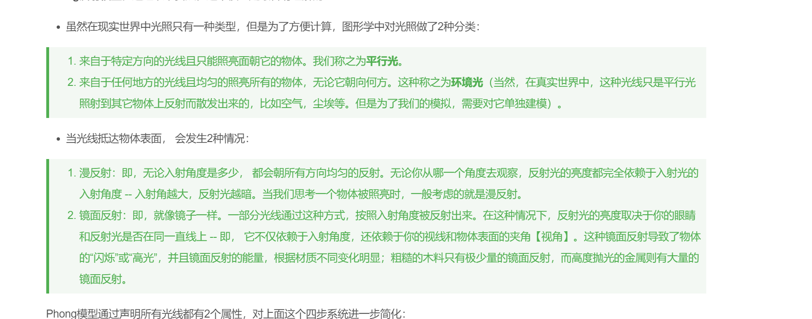

#### 5/6

1. `babylon`中`getChildTransformNodes`,`getChildren`,`getChildMeshes`三者之间的区别，用到这三种方法的时候，肯定是需要拿到模型的结构，刚开始我是直接使用的`getChildMeshes`，拿到的是一个扁平化的结构，其中也不包括`TransformNode`，因为我当时那个模型结构非常简单，以为就是正常的，到后来使用到复杂的模型，才发现不行，后面改成使用`getChildren`就可以得到一个完成的具有嵌套层级的结构，我的使用场景还比较复杂，不止获取模型切换，还要将他的子节点信息转换为配置项发送给后端，这里使用的是嵌套结构发送，但是当初始化的时候，我会做一个扁平化的操作，也就是将数组扁平化，`getChildTransformNodes`这个使用就是将一个模型的所有结构都做扁平化，包括他的`TransformNode`，这也是和`getChildMeshes`有区别的地方

2. [typescript5.5 beta](https://mp.weixin.qq.com/s?__biz=MzI2MjcxNTQ0Nw==&mid=2247507108&idx=1&sn=ff5031e632b1a6759217d579f2e3cbb2&chksm=ebd3e9cd8e972e9c9bf6fc2d919ed8445c31fa1b3f0dbbd88ef20cf17012672d26e718748944&scene=126&sessionid=1714984807#rd)


#### 5/8
1. 从pnpmv7.18.2升级到pnpmv9.1.0,使用pnpm link --global会出现一个警告，不过不要紧，但是现在使用pnpm link --global <pkg>并不会更新package.json，只会在当前的node_modules上链接成功，需要自己调，如果你不在package.json上手动修改，也可以
2. [去除重复依赖打包](https://rsdoctor.dev/zh/blog/topic/duplicate-pkg-problem)

#### 5/9
1. BI之前是通过hash读取对应的值进行数据的获取并渲染，现在改为params因为这样不会规定死路由，在提供一层进行数据的转换，不用都写在render里面


#### 5/10
1. [三维中的坐标系](https://blog.csdn.net/weixin_40693643/article/details/127419230)

#### 5/13
1. bun https://www.51cto.com/article/778311.html
2. nodejs中使用require导入和使用fs.readFile少有区别的，fs可以动态读取，因为打包之后他还是一个方法，但是module.exports，打包之后少代码，而不是一个引入的地址，所以内容是静态的

#### 5/14
1. [JSON Patch](https://github.com/Starcounter-Jack/JSON-Patch)
2. 直接require一个json文件是一个对象类型，使用fs导入就会是一个json,使用场景发生在使用prettier格式化中,如果使用require导入json直接报错
```ts
import prettier from "prettier";
import parserBabel from "prettier/parser-babel";
import { readFileSync } from 'fs';
import process from 'process';
import path from 'path';


const content = readFileSync(path.resolve(process.cwd(), 'config.json'), 'utf-8');
const formattedContent = prettier.format(content, {
  parser: "json-stringify",
  plugins: [parserBabel],
  singleQuote: true,
  jsxSingleQuote: false,
});

console.log(formattedContent);
```
3. xt-ui，dumi升级尝试，有一1.x到2.x差距太大升级失败，想升级的主要原因是node版本太低不能使用高版本的pnpm，以为使用corepack就能轻松切换pnpm版本，但是并没有，网上说的corepack prepare xxx --activate在执行pnpm -v根本没有效果

<!--
5/30补充
直接使用corepack use pnpm@xxx就可以，前提要开启corepack enable
  -->

#### 5/15
1. babylon中点光源和聚光灯的区别
- 点光源类似于灯泡蜡烛，是全方位的发散光源，聚光灯是特定的方向发散，并且会根据距离减少光源的强弱
2. 定向光和半球光的区别
- 定向光就是一种平行光，类似于太阳的光线。通常用于模拟自然光照
- 半球光模拟环境光，所以通过的方向是光的反射方向，而不是入射方向。半球光不会投射阴影



#### 5/21
1. [babel-plugin-import](https://blog.csdn.net/qq_42415326/article/details/125047269)
2. BI中的组件使用了`@xt-ui/core`之后，体积变的很大，好像并没有实现按需加载，但是我使用的也是esm格式的，后面看了antd的打包模式，他会将每一个组件都单独打包成js\css文件，在配合`babel-plugin-import`使用，其中封装的代码在`@antd-desigin/tools`中,通过引入对应的文件来减少打包体积，但是我的xt-ui都是打包在一个index.js中的
3. 由于之前一个npm包发布错误，于是unpublish了，当我再次publish的时候，告诉我版本号已经存在，所以即使unpublish了还是会占用一个版本号

#### 5/22
1. 很有意思的一段代码
```ts
const {
  create_kb
} = api;

const methods = {
  createKb: {
    url: create_kb,
    method: 'post',
  }
};

const kbService = registerServer<keyof typeof methods>(methods, request);


import omit from 'lodash/omit';
import { RequestMethod } from 'umi-request';

type Service<T extends string> = Record<T, (params: any) => any>;

const registerServer = <T extends string>(
  opt: Record<T, { url: string; method: string }>,
  request: RequestMethod,
) => {
  const server: Service<T> = {} as Service<T>;
  for (let key in opt) {
    server[key] = (params?: any, urlAppendix?: string) => {
      let url = opt[key].url;
      const requestOptions = opt[key];
      if (urlAppendix) {
        url = url + '/' + urlAppendix;
      }
      if (opt[key].method === 'post' || opt[key].method === 'POST') {
        return request(url, {
          method: opt[key].method,
          data: params,
        });
      }

      if (opt[key].method === 'get' || opt[key].method === 'GET') {
        return request.get(url, {
          ...omit(requestOptions, ['method', 'url']),
          params,
        });
      }
    };
  }
  return server;
};

export default registerServer;

```


#### 5/25
1. [MQTT协议](https://worktile.com/kb/p/74384)

#### 5/28
1. [ts中的类型生成](https://mp.weixin.qq.com/s/SyFikFAbkoySOUya-c3Jmw)


#### 5/29
1. lodash中的[template](https://www.lodashjs.com/docs/lodash.template#_templatestring-options)功能,会将数组类型也转换成字符串，例如
```tsx
import { template } from "lodash-es";
const str = {
  a:${a}
}
const result = template(JSON.stringify(str))({
  a:[1]
})
// result
{
  a:"1"
}
```
后面看了template的源码，用的是str.replace进行的实现，所以他的返回参数一定是一个字符串

