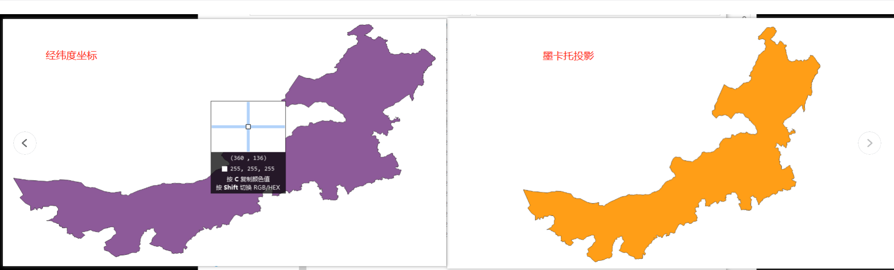

## 坐标转换

### 需求
1. 使用geojson绘制面
2. 加载模型，面显示在对应的模型区域

### 难点
1. 坐标转换
2. 建模时的坐标设置

### 实现
1. 经纬度坐标转换为场景坐标，也就是经纬度转为墨卡托坐标，在此之前我一直以为两者的效果是一样的，其实不一样，而且我的模型是内蒙古区域，跨度较大，偏差也会更大


```tsx
// 经纬度转为墨卡托
    function getMercator(poi) {
        var mercator = { x: 0, y: 0 };
        var earthRad = 6378137.0;
        mercator.x = poi.lng * Math.PI / 180 * earthRad;
        var a = poi.lat * Math.PI / 180;
        mercator.y = earthRad / 2 * Math.log((1.0 + Math.sin(a)) / (1.0 - Math.sin(a)));
        return mercator;
    }
```
2. 上面这一步不算麻烦，主要是如何对应到模型上，刚开始的想法是绘制面之后，把模型定位到对应的地方，然后camera直接对准改区域，但是就在模型定位这一步一直没达到效果，因为模型对比原始模型在建模的时候进行了缩放，缩放以后转的坐标是有问题，就算你把模型反比例缩放也不行，因为模型的坐标就不对，要解决这个问题，只能重新建模

3. 在模型上绘制面，以下是在平面上绘制的功能
https://playground.babylonjs.com/#2NJYI5#2135