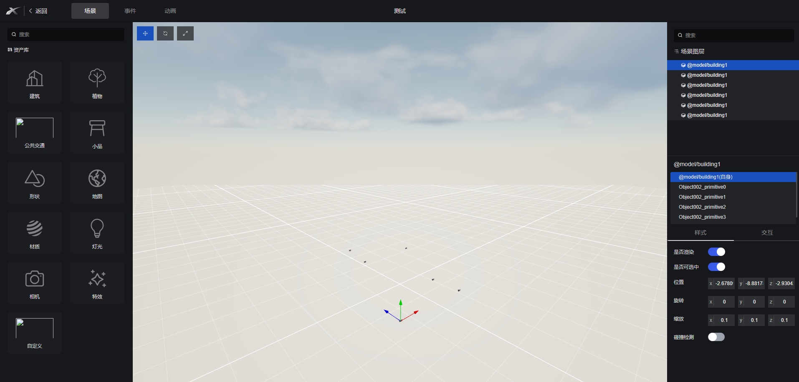

## 样式联动

#### 实现背景
1. 三维编辑器属于低代码编辑器中的一个组件，右键改组件进入编辑场景
2. 可以编辑模型的样式、添加交互和动画以及和其他组件做到联动

#### 前置依赖
1. [`xt-plugins/fusion3D`](https://xtspace.yuque.com/otnc49/fp1zbw/bdgriisqwz4xz0vi)基于babylon二次封装的库


#### 设计思路
1. 属于组件，所以和其他的大屏组件一样，需要放在物料中，有属于自己的`type`类型,后期通过type来做判断
2. 需要在该组件中做场景的初始化以及模型的加载等操作
3. 低代码平台都有自己的DSL语言，包括三维场景编辑器的配置表单也都是通过`schema`动态生成
4. 三维编辑器有属于自己的物料库，那么这些物料库也就是我说的`schema`，通过这些`schema`来驱动模型
5. 需要对schema当中的字段和`xt-plugins/fusion3D`进行关联

#### DSL展示
1. `schema`展示,以下是模型的配置项，可以看到当中key都是对应的babylon中mesh的属性
```json
{
  "config": {
    "setEnabled": {
      "name": "是否渲染",
      "type": "boolean",
      "default": true
    },
    "scaling": {
      "name": "缩放",
      "type": "vector3",
      "children": {
        "x": {
          "addonBefore": "x",
          "type": "number",
          "default": 1
        },
        "y": {
          "addonBefore": "y",
          "type": "number",
          "default": 1
        },
        "z": {
          "addonBefore": "z",
          "type": "number",
          "default": 1
        }
      }
    }
}
```


#### 联动思路
1. 可以看到我们的schema对应了babylon中某个模块的属性，所以只要能够实现schema的属性能修改对应的babylon模块就可以实现联动了，先来看一下ui样式

2. 监听右侧表单的`onChange`事件,然后找到对应的model，进行更改，那么model的创建是通过`@xt-plugins/fusion3D`来的，model在`fusion3D`中归为`gameObject`，所以他是有自己的生命周期的，例如创建、更新、销毁,那么我们现在需要用的就是更新，在创建每一个`gameobejct`时，都会给对象添加一个`tick`方法来实现更新操作
3. 找到对应的模型获取他的tick，所以我封装了一个`MeshManagement`,其中有一个`setCurMeshValue`方法
```ts
  setCurMeshValue(params: setCurMeshesParams) {
    const { mesh, value, assetId } = params;
    const { tick } = cache.get(assetId);

    tick(mesh, revertParams.parse(mesh, value));
  }
```
4. `revertParams`的作用是将将bi平台的数据格式转换为babylon兼容的数据格式，例如babylon中的`Color`是一个很大的对象，但是我不可能就这一整个对应都保存起来，发送给后端，所以BI当中有对应的`Color`格式，在修改时需要进行转化，有`revert`操作那肯定就有`convert`操作
5. 如果属性是方法怎么办，例如`schema`示例中的`setEnabled`属性，他明明是一个方法但是在表单中的显示方式只是一个`switch`开关,所以在tick方法中需要兼容修改的属性名是方法的可能性


#### 更新方法的实现
1. 代码示例
```ts
import { assignIn, isObject, get, hasIn, set, isFunction } from 'lodash-es';
import { ITask, Properties } from "../types/common";

export class Task implements ITask {
  tick<T>(
    params: Properties,
    handler?: (instance: T, fieldErrors: Properties) => void
  ): void {
    const fieldErrors = {} as Properties;

    for (let p in params) {
      if (hasIn(this, p)) {

        const data = isObject(params[p]) ? assignIn(get(this, p), params[p]) : get(params, p)
        isFunction(get(this, p)) ? get(this, p).call(this, data) : set(this, p, data);
        
      } else {

        fieldErrors[p] = params[p];
      }
    }

    handler?.(this as unknown as T, fieldErrors);
  }
}

```

2. 可以看到如果是方法就会执行call操作，将对应的属性值传给当前的方法