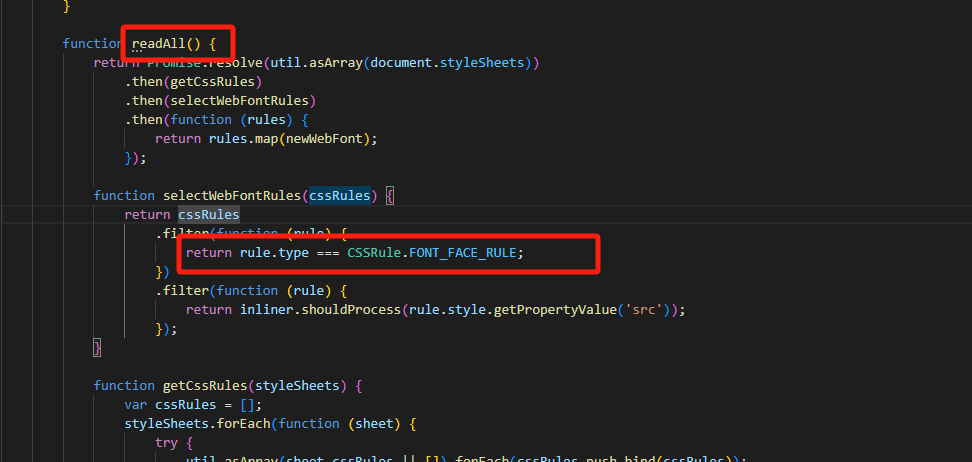

## 截图功能

### 功能描述
截取屏幕中的某一个区域生成一张图片，换句话说就是截取某一个元素生成一张图片

### 背景描述
我们是一个低代码平台，其中中间部分是编辑区域，并且可以缩放大小，上下滚动，其中这个部分相当于就是对你应用的预览，需要对你搭建的应用有一个截图功能，方便转发参考或者当成封面图

### 工具库踩坑
以下列举了两个工具库
- html2Canvas
- dom-to-image

###  [html2Canvas](https://html2canvas.hertzen.com/)

项目最开始使用的就是html2Canvas，并且图片也正常生成了，但是后面测试反馈缩放比列大于1时就会出现空白区域，其实这里描述的并不准确，并不是缩放大于1会出现空白，而是当这个元素超出了浏览器的屏幕就会出现空白，我看网上的解决方式就是设置宽高、或者x、y,我尝试了x、y的设置，有那么一瞬间以为真的可以成功了，但是他有一个bug是你全屏模式和非全屏模式居然效果不一样，而且你在不同百分比的情况下，x\y的动态计算很容易出现偏差，我用了一个下午的时间进行计算，最后也放弃了，到后面我换了下面一种方式`dom-to-image`

### [dom-to-image](https://github.com/tsayen/dom-to-image)
- 问题一： 截图显示不全，没有占满有一部分透明背景

造成这个问题的原因是我在当前需要截图的元素中设置了transform:scale因为我的画布是需要缩放的（后面才发现），我想了一个办法，他不是没有撑满吗，我对他的宽高进行对应的缩放不就好了，代码大致如下
```ts
export function screenshot(targetElement: HTMLElement) {
  return new Promise((resolve, reject) => {
    window.domtoimage
       .toBlob(targetElement, {
        width: scale <= window.devicePixelRatio ? width * (1 / scale) : width * scale,
        height: scale <= window.devicePixelRatio ? height * (1 / scale) : height * scale,
        style: {
          transform: scale <= window.devicePixelRatio ? `scale(${1 / scale})` : `none`,
          transformOrigin: "left top",
        }
      })
      .then(async (blob: Blob) => {
        let filename = `${new Date().getTime()}.webp`;
        let file2 = new File([blob!], filename, { type: "image/webp" });
        let formData = new FormData();
        formData.set("file", file2);

        let res = await uploadImage(formData);
        if (res?.data?.code === 200) {
          resolve(res.data.data?.url);
        }
      })
      .catch((err: Error) => {
        reject(err);
      });
  });
}

```

- 问题二

问题一种的解决方法看似没有问题，其实如果背景是图片的话就会暴露出来了，测试的时候用的背景是一个backgroundColor，如果换成一张image，就会显示不全，所以还是不能用我上面这种魔法，那换个方向，就是我现在的scale是放在当前的截图元素上，如果我在外层包一个盒子不也可以吗，于是我把scale放在了外层盒子，并且这样我就少了很多多余的逻辑，直接调用就可以了，代码如下
```ts
export function screenshot(targetElement: HTMLElement) {
  return new Promise((resolve, reject) => {
    window.domtoimage
      .toBlob(targetElement)
      .then(async (blob: Blob) => {
        let filename = `${new Date().getTime()}.webp`;
        let file2 = new File([blob!], filename, { type: "image/webp" });
        let formData = new FormData();
        formData.set("file", file2);

        let res = await uploadImage(formData);
        if (res?.data?.code === 200) {
          resolve(res.data.data?.url);
        }
      })
      .catch((err: Error) => {
        reject(err);
      });
  });
}
```

- 问题三

`dom-to-image`对比`html2Canvas`生成图片速度慢很多，因为`dom-to-image`会默认加载你当前项目的样式表，并且把所有的font全部下载下来，就算你没有用到，也是如此，可想而知，如果你的项目里面用到了很多的font将会非常慢，我在`github`上看到很多的`issue`和`pr`再说这个问题，但是作者就是没有解决，看看他的代码逻辑


解决方式就是我自己下载js，删掉这部分的逻辑。。。


### 方案对比

1. html2Canvas对比dom-to-image有较好的类型支持，因为html2Canvas是用ts写的，而dom-to-image只是一个简单js文件
2. html2Canvas提供两种方式一种是svg的ForeignObject方式，还有一种就是canvasRender，但是dom-to-image只是通过一个canvas去显示svg创建的一个元素,本质上它其实只有一种方式
