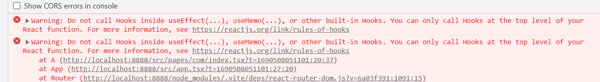
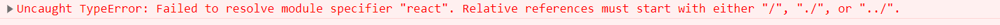

## 远程加载组件

#### 使用场景
低代码平台会使用到很多组件，并且需要对组件进行版本管理，并且当用户自定义组件时可以远程发布进行加载

#### 实现方法
中间踩过很多坑，比如刚开始使用import()进行动态加载，使用`@loadable/component`实现，最后使用了react中的`lazy`，接下来逐一说明使用上述各个方法遇到的问题，以及为什么选择了`lazy`

1. 使用import()，当使用此方法进行动态unpkg.com加载时，会报错误，意思就是useEffect需放在顶层使用，但是进行动态加载，我肯定是需要监听url中对应参数的变化，肯定会使用useEffect，于是尝试失败


2. import()使用失败，最后使用了`@loadable/component`也是我做了各种尝试，最接近成功的意思，但是过程也十分的坎坷，加载时，一直报，于是使用了插件`rollup-plugin-external-globals`,将react映射到全局，并且在main.tsx文件中将React挂载在全局，在此使用了网上说的在index.html中加载react的cdn，但是会报存在多个react副本，所以只能将react挂载在全局，由于package.json中没有使用type:module，而我打包的类型是es，所以文件的后缀名是mjs,就因为这个后缀名把我害惨了，这个使用我已经将上述的配置全部完成但是还是不行，就是因为这个后缀名，后面通过output配置规定了后缀名为js，这才顺利加载，就当我以为要成功的时候，我发现则个插件居然不容错，他们的容错机制就是使用fallcack方法，然后配合`Suspense`使用，但是我是根据组件的对应的版本进行加载，如果某个组件的版本根本不存在，这个时候就会黑屏，因为这个插件无论加载成功或失败都会返回一个react元素，这个时候一点都不好做判断，当渲染这个不存在的组件时，肯定会造成黑屏，于是我选择了`lazy`


3. `lazy`其实这个方法无论加载成功或失败也都会返回一个react元素，但是其中有一个`_payload.result`方法,调用此方法，如果加载地址错误，他的返回值就是对应的错误信息，这个时候我就可以通过try...catch进行容错判断，如果报错直接复制为null不让错误的组件渲染在页面上

#### 实现代码
```tsx
import React, { Suspense, lazy, useEffect, useMemo, useState } from "react";
import { ComponentProps } from "@xt-bi/shared";
import { components, prefix } from "./source";

type Props = Partial<ComponentProps>;

const DynamicFunc = React.memo((props: Props) => {
  const { type, comVersion } = props ?? {};
  const [Component, setComponent] = useState<React.ComponentType<Props> | null>(null);

  useEffect(() => {
    loadComponent();
  }, [props]);

  // 加载已发布组件
  const loadComponent = async () => {
    try {
      const RemoteComponent = (await lazy(
        () => import(`https://unpkg.com/@xt-bi/ui-${type}@${comVersion}/dist/index.js`),
      )) as React.LazyExoticComponent<React.ComponentType<Props>> & { _payload: { _result: () => void } };
      // 是否加载成功
      await RemoteComponent._payload._result();
      setComponent(RemoteComponent);
    } catch (error) {
      console.error(error);
      setComponent(null);
    }
  };

  // 加载未发布组件
  const loadLocalComponent = useMemo(() => {
    const key = `${prefix}/ui-${type}/src/index.tsx`;
    const Component = components[key]?.default as React.ComponentType<Props>;
    return Component && <Component {...props} />;
  }, [props]);

  return (
    <Suspense fallback={<div>Loading...</div>}>{Component ? <Component {...props} /> : loadLocalComponent}</Suspense>
  );
});

const DynamicEngine = React.memo((props: ComponentProps) => {
  const [cPorps, setCprops] = React.useState(props);

  React.useEffect(() => {
    setCprops(props);
  }, [JSON.stringify(props)]);

  const Dynamic = React.useMemo(() => {
    return <DynamicFunc {...props} />;
  }, [cPorps]);

  return <>{Dynamic}</>;
});
export default DynamicEngine;

```

vite.config.js代码
```ts
import { resolve } from "path";
import externalGlobals from "rollup-plugin-external-globals";
import { Plugin } from "vite";
import cssInjectedByJsPlugin from "vite-plugin-css-injected-by-js";
import react from "@vitejs/plugin-react";

interface ViteOpt {
  path: string;
}

export default (opt: ViteOpt) => {
  const { path } = opt ?? {};
  return path
    ? {
        plugins: [
          react(),
          cssInjectedByJsPlugin(),
          externalGlobals({
            react: "React",
          }) as Plugin,
        ],
        esm: "js",
        build: {
          lib: {
            entry: resolve(path, "src/index"),
            fileName: `index`, // 输出文件名
            formats: ["es"],
          },
          outDir: resolve(`${path}/dist`),
          rollupOptions: {
            external: ["@xt-ui/core", "react"],
            output: {
              entryFileNames: "[name].js",
              chunkFileNames: "[name]-[hash].js",
              assetFileNames: "[name].[ext]",
            },
          },
        },
      }
    : {};
};

```